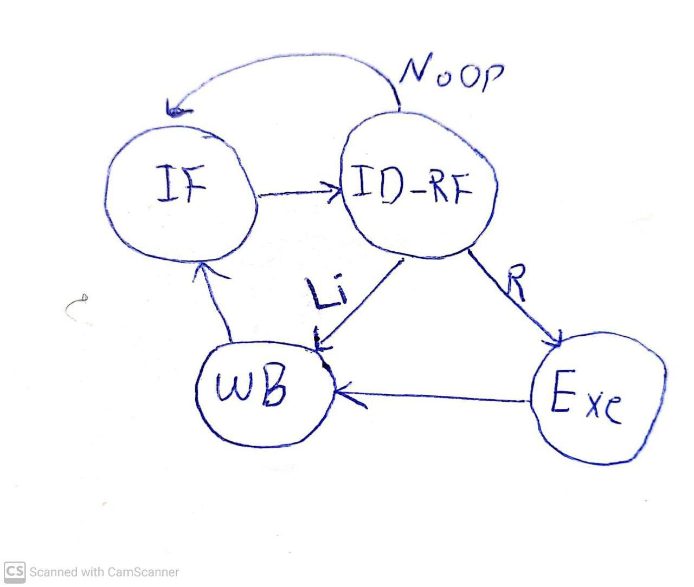

# Custom Multicycle DataPath Design 

Custom Multicycle DataPath Design on Quartus II 13.0sp1.

The multicycle microarchitecture is based on Dr.Asadi's *Computer Architecture* slides.

## Contributors

1. [Ahmad Salimi](https://github.com/ahmadsalimi)
2. [Hamila Mailee](https://github.com/hamilamailee)
3. [Saber Zafarpoor](https://github.com/SaberDoTcodeR)

## [Project Documentation](projectDescripition.pdf)

## Hierarchical Design

### High-Level Abstraction

This is the Highest Level Abstraction of our design. We have several components that will be explained.
PC Register, Instruction Register, Register File, ALU Unit and Control Unit are the main components.

### Low-Level Abstraction

#### Control Unit

This control unit was designed by one-hot method to convert below finite state machine to the above circuit.

